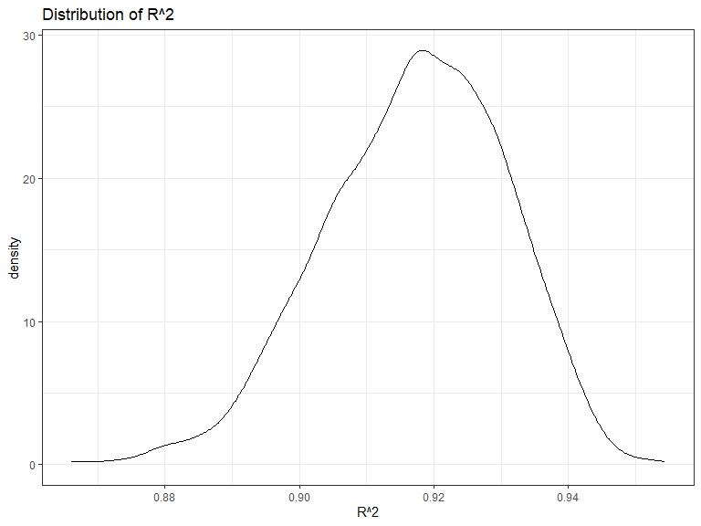
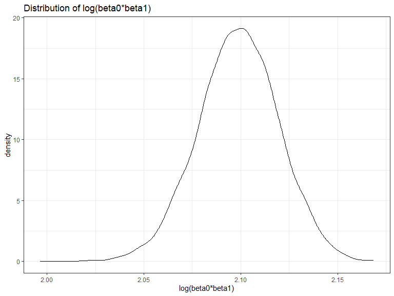

Homework 6
================
Yunshen Bai
2023-12-02

``` r
library(tidyverse)
library(modelr)
```

### Problem 1

In the data cleaning code below we create a `city_state` variable,
change `victim_age` to numeric, modifiy victim_race to have categories
white and non-white, with white as the reference category, and create a
`resolution` variable indicating whether the homicide is solved. Lastly,
we filtered out the following cities: Tulsa, AL; Dallas, TX; Phoenix,
AZ; and Kansas City, MO; and we retained only the variables
`city_state`, `resolution`, `victim_age`, `victim_sex`, and
`victim_race`.

``` r
homicide_df = 
  read_csv("./data/homicide-data.csv", na = c("", "NA", "Unknown")) |> 
  mutate(
    city_state = str_c(city, state, sep = ", "),
    victim_age = as.numeric(victim_age),
    resolution = case_when(
      disposition == "Closed without arrest" ~ 0,
      disposition == "Open/No arrest"        ~ 0,
      disposition == "Closed by arrest"      ~ 1)
  ) |> 
  filter(victim_race %in% c("White", "Black")) |> 
  filter(!(city_state %in% c("Tulsa, AL", "Dallas, TX", "Phoenix, AZ", "Kansas City, MO"))) |> 
  select(city_state, resolution, victim_age, victim_sex, victim_race)
```

    ## Rows: 52179 Columns: 12
    ## -- Column specification --------------------------------------------------------
    ## Delimiter: ","
    ## chr (8): uid, victim_last, victim_first, victim_race, victim_sex, city, stat...
    ## dbl (4): reported_date, victim_age, lat, lon
    ## 
    ## i Use `spec()` to retrieve the full column specification for this data.
    ## i Specify the column types or set `show_col_types = FALSE` to quiet this message.

Next we fit a logistic regression model using only data from Baltimore,
MD. We model `resolved` as the outcome and `victim_age`, `victim_sex`,
and `victim_race` as predictors. We save the output as `baltimore_glm`
so that we can apply `broom::tidy` to this object and obtain the
estimate and confidence interval of the adjusted odds ratio for solving
homicides comparing non-white victims to white victims.

``` r
baltimore_glm = 
  filter(homicide_df, city_state == "Baltimore, MD") |> 
  glm(formula=resolution ~ victim_age + victim_sex + victim_race, family = binomial())

baltimore_glm |> 
  broom::tidy() |> 
  mutate(
    OR = exp(estimate), 
    OR_CI_upper = exp(estimate + 1.96 * std.error),
    OR_CI_lower = exp(estimate - 1.96 * std.error)) |> 
  filter(term == "victim_sexMale") |> 
  select(OR, OR_CI_lower, OR_CI_upper) |>
  knitr::kable(digits = 3)
```

|    OR | OR_CI_lower | OR_CI_upper |
|------:|------------:|------------:|
| 0.426 |       0.325 |       0.558 |

Below, by incorporating `nest()`, `map()`, and `unnest()` into the
preceding Baltimore-specific code, we fit a model for each of the
cities, and extract the adjusted odds ratio (and CI) for solving
homicides comparing non-white victims to white victims. We show the
first 5 rows of the resulting dataframe of model results.

``` r
model_results = 
  homicide_df |> 
  nest(data = -city_state) |> 
  mutate(
    models = map(data, \(df) glm(resolution ~ victim_age + victim_sex + victim_race, 
                             family = binomial(), data = df)),
    tidy_models = map(models, broom::tidy)) |> 
  select(-models, -data) |> 
  unnest(cols = tidy_models) |> 
  mutate(
    OR = exp(estimate), 
    OR_CI_upper = exp(estimate + 1.96 * std.error),
    OR_CI_lower = exp(estimate - 1.96 * std.error)) |> 
  filter(term == "victim_sexMale") |> 
  select(city_state, OR, OR_CI_lower, OR_CI_upper)

model_results |>
  slice(1:5) |> 
  knitr::kable(digits = 3)
```

| city_state      |    OR | OR_CI_lower | OR_CI_upper |
|:----------------|------:|------------:|------------:|
| Albuquerque, NM | 1.767 |       0.831 |       3.761 |
| Atlanta, GA     | 1.000 |       0.684 |       1.463 |
| Baltimore, MD   | 0.426 |       0.325 |       0.558 |
| Baton Rouge, LA | 0.381 |       0.209 |       0.695 |
| Birmingham, AL  | 0.870 |       0.574 |       1.318 |

Below we generate a plot of the estimated ORs and CIs for each city,
ordered by magnitude of the OR from smallest to largest. From this plot
we see that most cities have odds ratios that are smaller than 1,
suggesting that crimes with male victims have smaller odds of resolution
compared to crimes with female victims after adjusting for victim age
and race. This disparity is strongest in New yrok. In roughly half of
these cities, confidence intervals are narrow and do not contain 1,
suggesting a significant difference in resolution rates by sex after
adjustment for victim age and race.

``` r
model_results |> 
  mutate(city_state = fct_reorder(city_state, OR)) |> 
  ggplot(aes(x = city_state, y = OR)) + 
  geom_point() + 
  geom_errorbar(aes(ymin = OR_CI_lower, ymax = OR_CI_upper)) + 
  theme(axis.text.x = element_text(angle = 90, hjust = 1))
```


## Problem 2

For this problem, we’ll use the Central Park weather data. The code
chunk below will download these data.

``` r
weather_df = 
  rnoaa::meteo_pull_monitors(
    c("USW00094728"),
    var = c("PRCP", "TMIN", "TMAX"), 
    date_min = "2022-01-01",
    date_max = "2022-12-31") |>
  mutate(
    name = recode(id, USW00094728 = "CentralPark_NY"),
    tmin = tmin / 10,
    tmax = tmax / 10) |>
  select(name, id, everything())
```

The function to generate our bootstrap samples is

``` r
boot_sample = function(df) {
  sample_frac(df, replace = TRUE)
}
```

Use 5000 bootstrap samples and, for each bootstrap sample, produce
estimates of $R^2$ and $log(\beta_0*\beta_1)$.

``` r
boot_straps_weather = 
  tibble(strap_number = 1:5000) |> 
  mutate(
    strap_sample = map(strap_number, \(i) boot_sample(df = weather_df|>drop_na()))
  )
```

Next, we use `broom::glance()` and `broom::tidy()` functions to get
these two quantities.

``` r
bootstrap_results_log_beta0_beta1 = 
  boot_straps_weather |> 
  mutate(
    models = map(strap_sample, \(df) lm(tmax ~ tmin+prcp, data = df) ),
    results = map(models, broom::tidy)) |> 
  select(-strap_sample, -models) |>
  unnest(results) |>
  select(strap_number,term,estimate)|>
  pivot_wider(
    names_from = "term",
    values_from = "estimate"
  )|>
  janitor::clean_names()|>
  mutate(log_beta1_beta2=log(tmin*intercept))|>
  pull(log_beta1_beta2)
```

``` r
bootstrap_results_r2 = 
  boot_straps_weather |> 
  mutate(
    models = map(strap_sample, \(df) lm(tmax ~ tmin+prcp, data = df) ),
    results = map(models, broom::glance)) |> 
  select(-strap_sample, -models) |>
  unnest(results) |>
  pull(r.squared)
```

Then, we plot the distribution of these two quantities, and describe
these in words

``` r
ggplot(data.frame(bootstrap_results_r2),aes(x=bootstrap_results_r2))+
  theme_bw() + 
  geom_density()+
  labs(
    x="R^2",
    title = "Distribution of R^2"
  )
```



``` r
ggplot(data.frame(bootstrap_results_log_beta0_beta1),aes(x=bootstrap_results_log_beta0_beta1))+
  theme_bw() + 
  geom_density()+
  labs(
    x="log(beta0*beta1)",
    title = "Distribution of log(beta0*beta1)"
  )
```



From above two density plots the distribution of $R^2$ and
$log(\beta_0*\beta_1)$, they under the normal distribution. Then, we are
interested in the confidence interval of these two quantities. We use
the 5000 bootstrap estimates, identify the 2.5% and 97.5% quantiles to
provide a 95% confidence interval for $R^2$ and $log(\beta_0*\beta_1)$.

``` r
CI_R2=quantile(bootstrap_results_r2,c(0.025,0.975))
CI_log_beta0_beta1=quantile(bootstrap_results_log_beta0_beta1,c(0.025,0.975))
CI_R2
```

    ##      2.5%     97.5% 
    ## 0.8885834 0.9405173

``` r
CI_log_beta0_beta1
```

    ##     2.5%    97.5% 
    ## 2.055144 2.138537

Therefore, the 95% confidence interval for $R^2$ is (0.8885834,
0.9405173), the 95% confidence interval for $log(\beta_0*\beta_1)$ is
(2.0551437, 2.138537).

## Problem 3
